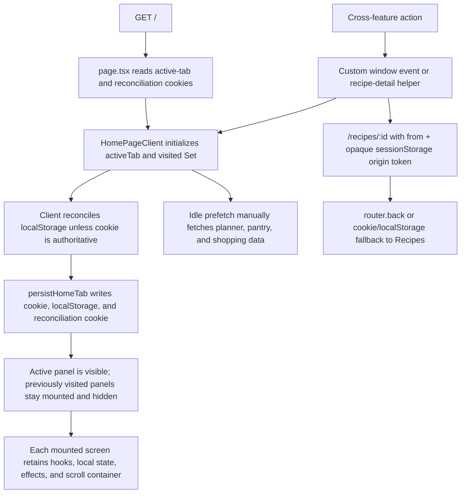
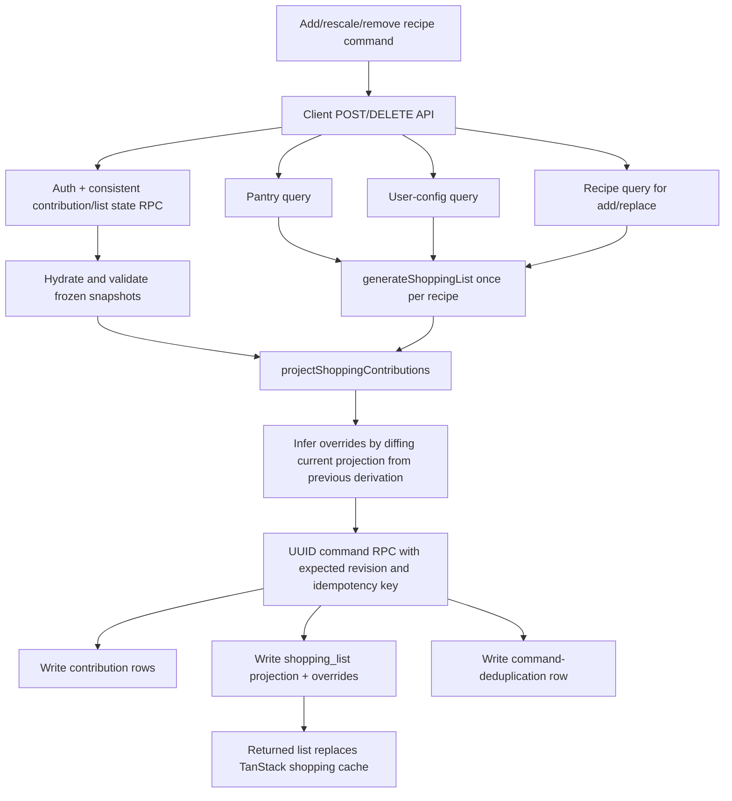
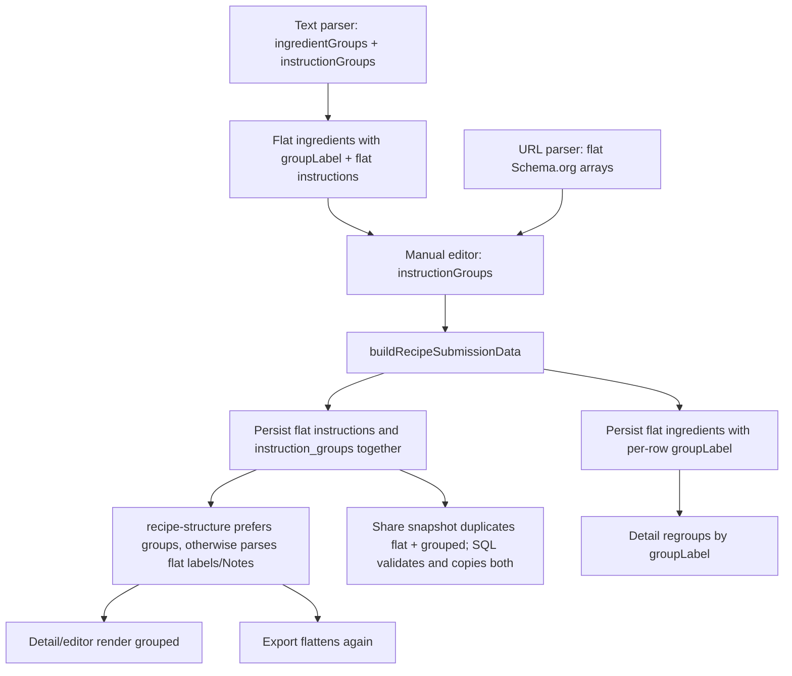

# Simplification flow audit

Scope: design and flow audit only. This report was prepared from `main` at
`92f47b5b1ab1562671cece388fe4521da33259df`. It does not authorize or implement
application, schema, migration, or production changes.

The evidence is static repository evidence: active TypeScript, SQL, tests, and
architecture documents. No production data was queried and no benchmark was
built. Request counts below are call-path counts, not latency measurements.
Uncertain conclusions are labeled where they occur; payload and latency gains
remain directional until measured against representative user data.

## 1. Executive conclusion

All three areas are more complicated than the product behavior requires.

| Area | Conclusion | Primary benefit of simplification |
| --- | --- | --- |
| Home navigation | Materially overcomplicated. The URL is not the navigation authority, so cookies, local storage, reconciliation cookies, custom events, session tokens, hidden panels, and manual scroll state recreate browser behavior. | Runtime, browser UX, reliability, and maintainability. |
| Shopping | Severely overcomplicated. Recipe quantities and the rendered list have separate authorities, with overrides inferred by diffing them. Ordinary item actions still use whole-document read-modify-write despite the contribution command machinery. | Reliability, development speed, fewer round trips, and maintainability; byte/write-volume gains are unproven. |
| Recipe structure | Simplified in Slice B: ordered ingredient and instruction sections are now the only runtime/persistence authority. Boundary flattening remains only for Shopping and external formats. | Frozen legacy columns remain until the separately reviewed physical-removal slice. |

The recipe-flow diagrams and inventories below capture the pre-cutover audit
that motivated the change; they are historical evidence, not the current
runtime contract. See `recipes-component.md` for the active boundary.

Recommended priority:

1. Replace home tabs with four routes. This is independent, gives an immediate
   lifecycle/network win, and has the lowest data risk.
2. Establish one canonical sectioned recipe structure and one narrow shopping
   ingredient-resolution result. These give the shopping replacement stable
   inputs and keys.
3. Replace the contribution/projection system with one user-owned shopping
   document, then delete the transitional tables, columns, route, and helpers.

The recommended first implementation is the route shell and `/recipes`,
`/planner`, `/pantry`, and `/shopping` pages. It can proceed directly from this
report without another broad architecture investigation.

## 2. Current-state maps

### 2.1 Home navigation and tab lifecycle



Main ownership and boundaries:

| Concern | Current owner | Source of truth in practice |
| --- | --- | --- |
| Initial screen | `web/src/app/page.tsx`, `home-tab-state.ts` | Cookie, unless a reconciliation cookie says it is authoritative. |
| Client reconciliation | `home-page-client.tsx`, `home-navigation.ts` | Valid local-storage value normally overrides the server-selected cookie. |
| Current navigation | `HomePageClient.activeTab` | React state; the URL remains `/`. |
| Cross-feature tab change | `navigateToHomeTab()` | A custom `recipe-genie:navigate-home-tab` window event plus persistence writes. |
| Lifecycle | `HomePageClient.visited` | Four panels exist; Recipes mounts immediately and each other panel mounts once, then stays mounted invisibly. |
| Scroll | Per-panel `overflow-y-auto`; `pane-scroll.ts`; Recipes session state | DOM retention plus explicit panel lookup and pane-relative scrolling. |
| Detail return | `recipe-detail-navigation.ts` | Browser history accepted only with a fresh opaque session-storage origin record; otherwise persistence is rewritten to Recipes. |
| Recipe browse state | `recipe-list.tsx` | Versioned session storage plus a separate local-storage view-mode preference. |
| Planner state | `meal-planner.tsx` | Versioned session storage for week and mobile subtab. |
| Server data | Root `QueryClientProvider`; domain hooks | TanStack Query keys are already principal-scoped and remain above page navigation in `app/layout.tsx`. |

Lightweight evidence:

- After visiting all tabs, four top-level screens are mounted. The core E2E
  test explicitly asserts hidden Shopping and Pantry inputs remain in the DOM.
- Those screens collectively install at least 11 distinct query observers in a
  normal all-tabs-visited session: recipe list, recipe categories, history
  stats, planner week, weekly recipes, recent history, a planner recipe probe,
  shopping list, pantry list, full recipes, and user configuration. Shared keys
  deduplicate some requests, but hidden screens remain observers and still
  process cache changes and focus/refetch policy.
- After Recipes loads, `home-page-client.tsx` can issue up to five speculative
  requests for screens the user has not opened: full config, a second config
  read for history depth, recent history, pantry, and shopping. The connection
  check only skips these on `2g`/`slow-2g`.
- Route chunks for Planner, Pantry, and Shopping are manually loaded through
  `next/dynamic`; normal App Router pages would already be route-split.
- Four central navigation test files contain 27 named `it`/`test`
  declarations, before expanding parameterized cases. Much of this verifies
  storage failure and reconciliation behavior rather than product behavior.
- Tab clicks do not create browser-history entries, cannot be deep-linked, and
  make refresh behavior depend on storage. Only recipe detail has a real route.

### 2.2 Shopping persistence and mutations



Current persistent roles:

| Store | Role |
| --- | --- |
| `shopping_recipe_contributions` | Authoritative frozen recipe quantities, one row per user/recipe. |
| `shopping_list.items`, `already_have`, `excluded` | Persisted rendered projection and authority for manual items, check state, display, buckets, and order. |
| `shopping_list.contribution_overrides` | User intent inferred from differences between the projection and a regenerated prior projection. |
| `shopping_list.contribution_revision` | Compare-and-swap coordination between direct list updates and recipe commands. Every list update advances it. |
| `shopping_list.legacy_items_preserved` | Transitional flag for ambiguous pre-contribution JSON. |
| `shopping_contribution_commands` | Idempotency records for recipe commands. |
| `user_config` | Category overrides, custom categories, category order, item order, exact exclusions, and two family exclusions. |
| `pantry_items` | Pantry authority and generation input. |
| TanStack cache plus `useShoppingPendingActions` | Optimistic projection and an in-memory deferred-delete/clear queue. |

Recipe command flow is centralized but expensive. One add or rescale is one
browser request followed by authentication, three parallel state/context
reads, one recipe read, and one apply RPC: six backend calls including auth.
The apply RPC writes one or more contribution rows, the shopping-list row, and
an idempotency row. Remove/clear skips the recipe read but retains the other
calls. A revision conflict repeats the state, pantry, config, recipe, projection,
and apply work up to four times.

Ordinary actions follow a different, less safe model:

| Representative action | Current network/database path |
| --- | --- |
| Manual add | Config read in `onMutate`, config read again in `mutationFn`, shopping-list read, whole `items` update, then invalidation/refetch: up to five calls. |
| Manual edit | The same two config reads, shopping-list read, and whole `items` update: four calls. |
| Remove item | Deferred for five seconds, then shopping-list read + whole-array update + explicit invalidation/refetch: three calls. |
| Check/uncheck | Shopping-list read + whole-array update: two calls. The existing `toggle_shopping_item_checked` RPC is not called. |
| Bulk check | Shopping-list read + whole-array update + refetch: three calls. |
| Restore pantry/excluded row | Shopping-list and item-order config reads, whole-list update, then refetch: four calls. |
| Move to pantry | One atomic `move_shopping_item_to_pantry` RPC, followed by focused cache reconciliation. This is the cleanest current mutation. |
| Reorder within a category | Item-order config read, shopping-list update, user-config upsert, and two invalidation/refetches: up to five calls. |
| Move across categories | Category-override read/update/refetch, then the reorder flow; up to eight calls and two separately failing stages. |
| Complete shopping | The clear command path: one browser request, auth + three state/context reads + apply RPC, then contribution/list/command writes. |

The main transformation path is also repeated:

1. `shopping-list.ts` walks recipe ingredients, calls
   `normalizeShoppingPurchase()`, aggregates, categorizes, and classifies.
2. `shopping-list-merging.ts` normalizes again while merging recipe snapshots.
3. `shopping-contributions.ts` derives another key, upgrades version-1 keys in
   memory, merges all contributions, reconstructs prior derivation, infers
   overrides, and projects buckets again.
4. `shopping-list.tsx` merges `already_have` again for display and derives
   category/order view models.

The persisted and API payload repeats recipe-derived information: a generated
item is stored in a contribution snapshot and again in a projected bucket; its
quantity also appears at item level and in source provenance. The recipe command
sends the complete regenerated projection back through the RPC. This is a
serialization and validation cost even when only one recipe scale changed.

### 2.3 Recipe flat/grouped compatibility



Active representations:

| Concept | Active representations and boundaries |
| --- | --- |
| Ingredients | Parser returns `ingredientGroups` and `ingredients`; persisted/domain `ingredients` is flat with optional `groupLabel`; detail calls `getRecipeIngredientGroups()` to regroup; shopping and scaling consume the flat array. There is one persisted ingredient array, but group structure is encoded indirectly on every row. |
| Instructions | Parser returns `instructionGroups` and `instructions`; editor owns groups; submission persists both `instructions` and `instruction_groups`; render prefers groups and falls back to parsing flat section labels; export flattens groups; sharing carries both. |
| Notes | `notes` is first-class, but `recipe-structure.ts` still reads a legacy `Notes:` marker embedded in flat instructions. |
| URL import | Schema.org `HowToSection` input is flattened by `recipe-url-parser.ts`; the dialog rebuilds a single editor group. |
| Share acceptance | `RecipeShareSnapshot` requires flat `instructions` and optionally carries `instruction_groups`; migration 014 validates and inserts both copies. |
| Quantity | Each ingredient also carries legacy `amount`/`unit` plus optional structured `quantityV1`/`packageV1`. This is a separate compatibility axis and should not be silently folded into the structure migration. |

Evidence and costs:

- `buildRecipeSubmissionData()` always flattens editor groups and writes the
  grouped array, making every current editor save a dual write.
- For grouped recipes, instruction text is serialized approximately twice in
  the recipe row and again twice in a share snapshot. All main recipe queries
  use `select("*")`, so list and planner fetches receive both copies even when
  they do not render instructions.
- The active compatibility surface touches 15 non-test TypeScript/SQL files.
  Ten focused test files explicitly mention grouped-instruction compatibility;
  the broader fixtures also require flat fields on every `Recipe` object.
- The five central compatibility functions in `recipe-structure.ts` have 18
  definition/call references: group preference, flat fallback, legacy note
  splitting, editor hydration, and export flattening.
- Ingredient grouping is not a true dual persistence problem, but flattening
  then grouping by label loses a clear section boundary. Repeated labels are
  coalesced by label rather than preserved as distinct ordered sections.

## 3. Complexity findings

### N1 — Navigation has duplicate authorities

- **Current design:** React state, two cookies, local storage, session storage,
  browser history, and the URL each own part of navigation or restoration.
- **Why complex:** None can be trusted alone because tab changes do not change
  the URL. Reconciliation code repairs disagreements created by that choice.
- **Why it exists:** The original single-page/tab shell survived the Next.js
  migration and later gained server-safe fallback behavior for detail return.
- **Still necessary:** No. A route is a server-readable, refresh-safe,
  history-aware navigation authority.
- **Concrete cost:** Storage failure branches, hydration tests, custom events,
  opaque origin records, non-deep-linkable screens, and possible initial tab
  switching after hydration.
- **Evidence:** `page.tsx`, `home-tab-state.ts`, `home-navigation.ts`,
  `home-page-client.tsx`, and `recipe-detail-navigation.ts`.
- **Severity:** High.

### N2 — Kept-mounted panels retain unnecessary lifecycle work

- **Current design:** A visited screen remains mounted inside an invisible,
  pointer-disabled absolute panel.
- **Why complex:** DOM retention is being used for state, scroll, and perceived
  speed, so every screen must understand the custom pane scroll model.
- **Why it exists:** It preserves component-local state and avoids remount query
  startup.
- **Still necessary:** Mostly no. TanStack Query already retains server data;
  meaningful browse/planner state already has explicit persistence. Modal-open,
  collapse, hover, and temporary drag state need not survive primary navigation.
- **Concrete cost:** Four top-level subtrees, at least 11 distinct query
  observers after visiting all tabs, hidden effects/listeners, and hidden
  re-renders on cache/config changes.
- **Evidence:** `visited` and four panels in `home-page-client.tsx`; the
  kept-mounted assertion in `web/tests/navigation.spec.ts`.
- **Severity:** Medium.

### N3 — Manual prefetch duplicates screen ownership

- **Current design:** The home shell knows Supabase selects and query keys for
  Planner, Pantry, and Shopping.
- **Why complex:** Query definitions are duplicated outside the hooks that own
  them, including a second config read solely to calculate history depth.
- **Why it exists:** It attempts to hide first-tab latency without mounting
  every tab immediately.
- **Still necessary:** No. Route/link prefetch can load code, and TanStack cache
  retention plus focused hover/intent prefetch can be added only if measured.
- **Concrete cost:** Up to five idle requests for unused screens; select-list
  drift risk when config/schema changes; cross-domain coupling in the shell.
- **Evidence:** The idle `prefetch()` block in `home-page-client.tsx`.
- **Severity:** Medium.

### N4 — Scroll and detail return are repair layers around the shell

- **Current design:** Body scrolling is disabled; each tab is its own scroller;
  Shopping uses `pane-scroll.ts`; Recipes snapshots panel scroll; detail return
  needs a session token and persistence fallback.
- **Why complex:** Browser scroll/history behavior cannot operate naturally on
  hidden same-URL panels.
- **Why it exists:** Fixed header/mobile navigation and kept-mounted tabs.
- **Still necessary:** No, except preserving browse filters/week selection.
- **Concrete cost:** Pane selectors and offsets, storage validation, and source
  return paths that can disagree with browser navigation.
- **Evidence:** `app/layout.tsx`, `pane-scroll.ts`, `recipe-list.tsx`,
  `recipe-detail-navigation.ts`, and Shopping jump code.
- **Severity:** Medium.

### S1 — Shopping has two authorities

- **Current design:** Contribution rows own recipe quantities while the
  `shopping_list` JSON projection owns manual rows and visible state.
- **Why complex:** Every recipe command must reconstruct both sides and keep
  them transactionally aligned.
- **Why it exists:** Reversible per-recipe quantities were added without
  redesigning the existing JSON list.
- **Still necessary:** No. One active contribution per recipe and one user list
  fit in one bounded document.
- **Concrete cost:** Two persisted copies of derived rows, three write targets,
  revision/idempotency machinery, a 573-line API route, and a 511-line
  reconciliation module.
- **Evidence:** migration 006, `shopping-contributions.md`, the contribution
  route, and `shopping-contributions.ts`.
- **Severity:** High.

### S2 — User intent is inferred instead of recorded

- **Current design:** `captureOverrides()` regenerates the prior derived list,
  compares quantities/buckets/display/order, treats missing rows as deletion,
  and includes version-1 ambiguity rules.
- **Why complex:** The projection is both output and editable input, so absence
  and difference have to be reverse-engineered.
- **Why it exists:** Existing list editing was preserved after contributions
  became authoritative.
- **Still necessary:** No. Mutations should write explicit intent at the moment
  the user checks, moves, renames, resizes, suppresses, or orders a row.
- **Concrete cost:** Legacy-key canonicalization, category disambiguation,
  `derivedQuantity`, `legacyRecipeProvenance`, conservative replacement rules,
  and a large regression matrix.
- **Evidence:** `captureOverrides()`, `findOverride()`,
  `isConfidentLegacyReplacement()`, and `applyOverride()`.
- **Severity:** High.

### S3 — Ordinary item mutations are whole-document read-modify-write

- **Current design:** Most item hooks fetch current JSON, modify an array, write
  the array, and often invalidate/refetch. Optimistic paths independently fetch
  config and repeat the transformation.
- **Why complex:** Hooks cannot safely use the cached document as the mutation
  input because the system also anticipates contribution-command concurrency.
- **Why it exists:** JSON array storage plus incremental hook evolution.
- **Still necessary:** No for a personal, last-writer-wins shopping document.
  Cross-table pantry moves should remain atomic.
- **Concrete cost:** Two to eight calls per simple user action, whole-array
  serialization, lost-update windows, duplicated optimistic/server logic, and
  visibly partial category/order failures.
- **Evidence:** `use-shopping-items.ts`, `use-shopping-categories.ts`,
  `use-shopping-pantry.ts`, and `handleDragEnd()` in `shopping-list.tsx`.
- **Severity:** High.

### S4 — Command concurrency controls exceed the real collaboration model

- **Current design:** Idempotency keys, a command table, expected revision,
  row locking, four full retries, fingerprints, and per-user mutation scopes.
- **Why complex:** It defends a multi-writer derived projection across tables.
- **Why it exists:** The hybrid model would otherwise lose recipe or manual
  edits under concurrent commands.
- **Still necessary:** Not at this level. A user-owned document still requires
  one revision/CAS predicate because stale browser tabs and devices are normal,
  but it does not require a command table, fingerprints, or four full retries.
- **Concrete cost:** Extra table, writes, logs, error states, route integration
  tests, and database security contracts.
- **Evidence:** `shopping_contribution_commands`,
  `contribution_revision`, `MAX_COMMAND_RETRIES`, and the apply RPC.
- **Severity:** Medium.

### S5 — Stable row identity is persisted beyond the boundary that needs it

- **Current design:** Every row in every bucket has a persisted `rowId`, missing
  IDs are backfilled on read and immediately written, and derived rows also
  retain IDs across regeneration.
- **Why complex:** Derived aggregate identity is being modeled as a mutable row
  identity rather than a deterministic ingredient identity.
- **Why it exists:** Name-based mutation was unsafe for duplicates.
- **Still necessary:** Manual items need stable persisted IDs. Derived rows only
  need a stable deterministic `aggregateKey` used by React, DnD, and explicit
  overrides; a broader `ingredientKey` remains useful for preferences.
- **Concrete cost:** Read-triggered writes, `rowId` validation/backfill helpers,
  override storage, and RPC parameters.
- **Evidence:** ADR-022, `shopping-row-identity.ts`, and `useShoppingList()`.
- **Severity:** Medium.

### S6 — Shopping preferences are split across domains and writes

- **Current design:** Categories, overrides, category order, item order, and
  exclusions live in `user_config`; items/order live in `shopping_list`; pantry
  lives separately. A category drag writes both config and list sequentially.
- **Why complex:** One user gesture changes a current row and a future default
  stored elsewhere.
- **Why it exists:** Shopping settings accumulated in a general user-config row.
- **Still necessary:** Pantry inventory should remain separate. Shopping-only
  preferences should be owned by the shopping document and applied during
  projection.
- **Concrete cost:** Cross-query invalidation, partial failures, duplicated
  reads, and UI ownership ambiguity.
- **Evidence:** `user_config` schema, shopping settings hooks, and drag flow.
- **Severity:** Medium.

### S7 — Active compatibility and dead paths remain on the normal surface

- **Current design:** The current schema still runs a missing-column fallback
  for `shopping_item_order`; an exported `useUpdateItemCategory()` has no
  production caller; `preserveCheckedItemsFromExisting()` is test-only; the
  checked-toggle RPC is documented/generated but the active hook does a direct
  JSON read/write.
- **Why complex:** Earlier implementations were retained after callers moved.
- **Why it exists:** Compatibility-first incremental delivery.
- **Still necessary:** No, after verifying production schema 015 and callers.
- **Concrete cost:** False architecture documentation, unused tests/exports,
  extra branches, and two competing mutation contracts.
- **Evidence:** `user-config-read.ts`, shopping barrel exports, call-site search,
  and `useCheckOffItem()`.
- **Severity:** Low.

### S8 — Deferred shopping deletion is lifecycle-sensitive

- **Current design:** Item delete, recipe removal, and clear are queued for five
  seconds; the visual list is projected locally, and commit happens on timer,
  dismissal, expiry, or component cleanup.
- **Why complex:** Correct persistence depends on a mounted hook, queue ordering,
  and cleanup timing.
- **Why it exists:** Undo was implemented as delayed commit.
- **Still necessary:** No. Persist explicit removal/suppression immediately and
  make Undo a compensating one-write restoration.
- **Concrete cost:** Refresh/close risk, invisible recipe-removal delay, timer
  tests, and route-unmount coupling. This also conflicts with the repository's
  documented immediate-delete shopping guidance.
- **Evidence:** `use-shopping-pending-actions.ts`.
- **Severity:** Medium.

### R1 — Instructions are always dual-written

- **Current design:** The editor owns groups, then every save writes the same
  steps to flat `instructions` and grouped `instruction_groups`.
- **Why complex:** Every reader must define precedence and every writer/share
  must keep both coherent.
- **Why it exists:** Grouping was added additively to preserve the old textarea
  and consumers.
- **Still necessary:** No after one migration. Flat output is an external
  derivation, not a persisted domain model.
- **Concrete cost:** Duplicate payload/storage, fallback converters, SQL
  validators, dual-write tests, and contradictory-state risk.
- **Evidence:** `buildRecipeSubmissionData()`, schema migration 002,
  `RecipeShareSnapshot`, and migration 014.
- **Severity:** High.

### R2 — Recipe structure cycles through grouped and flat forms

- **Current design:** Text parsing builds groups, flattens them, the dialog
  rebuilds groups, persistence writes both instruction forms, detail chooses and
  normalizes groups, and export flattens them again.
- **Why complex:** Internal boundaries do not share one type.
- **Why it exists:** Import flexibility and backwards compatibility were solved
  at each boundary independently.
- **Still necessary:** Only flattening at explicit external boundaries remains
  necessary.
- **Concrete cost:** Repeated trimming/label parsing, edge cases around `Notes:`,
  and fixtures that assert both shapes.
- **Evidence:** `recipe-parser.ts`, `recipe-dialog.defaults.ts`,
  `recipe-structure.ts`, and `recipe-export.ts`.
- **Severity:** Medium.

### R3 — Share snapshots multiply the compatibility contract

- **Current design:** Shares require flat instructions and optionally carry
  grouped instructions; database acceptance deeply validates and inserts both.
- **Why complex:** A copy boundary repeats the entire transitional recipe
  schema rather than the canonical recipe content.
- **Why it exists:** Copy-on-accept must remain durable across recipe deletion
  and was upgraded additively.
- **Still necessary:** The durable snapshot is necessary; duplicate structure
  is not.
- **Concrete cost:** Larger snapshots and a second SQL implementation of
  structural compatibility.
- **Evidence:** `recipe-sharing.ts`, `recipe-data-validation.ts`, and the
  validators/accept function in migration 014.
- **Severity:** Medium.

### R4 — Ingredient sections are encoded indirectly

- **Current design:** A flat ingredient row repeats `groupLabel`; parser group
  arrays are discarded after applying labels; detail regroups by label.
- **Why complex:** Section ordering/identity is implicit and repeated labels are
  merged by value.
- **Why it exists:** Shopping/scaling already consumed a flat array, so grouping
  was added without changing persistence.
- **Still necessary:** No. Shopping/scaling can use one pure `flatMap` at their
  boundary.
- **Concrete cost:** Parser dual outputs, regrouping, per-row label repetition,
  and inability to represent two separate same-label sections precisely.
- **Evidence:** `flattenIngredientGroups()` in the parser and
  `getRecipeIngredientGroups()` in `recipe-structure.ts`.
- **Severity:** Medium.

### R5 — Full recipe content is fetched by list-oriented queries

- **Current design:** `useRecipes()` and recipe command loading use
  `select("*")`; list/planner consumers receive ingredient and both instruction
  representations.
- **Why complex:** One broad Recipe query shape serves cards, planner,
  generation, and detail.
- **Why it exists:** It is simple at the hook level and lets every screen reuse
  the same cached objects.
- **Still necessary:** No. Two explicit shapes are sufficient: recipe summary
  and full recipe. This is a query shape, not a repository abstraction.
- **Concrete cost:** Larger initial/list payloads, JSON parsing, cache memory,
  and cache invalidations touching content unused by cards.
- **Evidence:** `use-recipes.ts` and the shopping contribution route.
- **Severity:** Medium.

### R6 — URL import drops available section structure

- **Current design:** Schema.org `HowToSection` values are flattened into a
  string array before the dialog sees them.
- **Why complex:** The URL parser exposes a flat-only DTO while text import and
  the editor understand groups.
- **Why it exists:** Standard Schema.org compatibility preceded grouped editor
  support.
- **Still necessary:** No. The importer should emit canonical sections; flat
  `HowToStep` input becomes one unlabeled section.
- **Concrete cost:** Fidelity loss and another special import path.
- **Evidence:** `parseRecipeInstructions()` and `ExtractedRecipe` in
  `recipe-url-parser.ts`.
- **Severity:** Low.

## 4. Simplest target design

### 4.1 Route-owned home screens

Use the App Router as the navigation model:

```text
app/(authenticated)/layout.tsx  -> auth shell, Header, BottomNav, onboarding
app/(authenticated)/recipes/page.tsx
app/(authenticated)/planner/page.tsx
app/(authenticated)/pantry/page.tsx
app/(authenticated)/shopping/page.tsx
app/(authenticated)/recipes/[id]/page.tsx
```

`/` redirects to `/recipes`. This is the only redirect required: there are no
legacy tab URLs to preserve, and old cookie/storage values can simply become
inert. Header and bottom navigation use `Link`; active state comes from
`usePathname()`. The root providers stay where they are, so TanStack Query cache
survives client-side route changes without new global state. Each page owns only
its queries and unmounts when left.

Keep the route files and the route-group layout as Server Components. The shared
layout renders one small client `AuthenticatedShell` because auth context,
onboarding, sign-out, `usePathname()`, and responsive navigation are client
concerns. `RecipeList`, `MealPlanner`, `PantryList`, `ShoppingListView`, and
`RecipeDetailPage` remain client components. Moving data fetching into Server
Components is a separate architecture change and is not needed for this cutover.

Use normal document scrolling. Returning from detail or traversing Back/Forward
must preserve document position; this is genuine user value for long recipe and
shopping lists. Primary navigation to a destination is allowed to start at the
top. Verify native restoration rather than assuming it: Next.js owns part of
client-navigation scroll behavior. If a focused test exposes a framework defect,
add only the narrow route-keyed restoration required for the affected route.

Meaningful view state belongs in the URL:

- Recipes: `?q=`, `category=`, `tags=`, `favorite=`, `sort=`, `view=`.
- Planner: `?week=YYYY-MM-DD`; the mobile Today/Week presentation can remain
  local because it does not identify different server data.
- Pantry search and Shopping manage/collapse state remain local and reset when
  leaving; they are incidental UI state.

Recipe detail links keep a whitelisted `from=recipes|planner|shopping` parameter
for the return label. App-owned links include it and the in-app Back control uses
browser history; a detail URL without it uses an explicit `/recipes` fallback.
It is display/navigation context, not security authority, so no opaque origin
token is needed. Native browser Back remains correct for direct/shared links.

Delete:

- `web/src/app/home-page-client.tsx`, `web/src/app/home-tab-state.ts`,
  `web/src/lib/home-navigation.ts`, and their storage/reconciliation unit tests.
- Tab cookies, local-storage active tab, reconciliation cookie, custom event,
  `visited`, four hidden panels, and manual dynamic imports.
- The shell's manual Supabase prefetch block.
- `web/src/lib/pane-scroll.ts` and home-panel selectors after page scroll
  conversion.
- The origin-token/session-storage portion of
  `web/src/lib/recipe-detail-navigation.ts`; retain at most a small typed route
  and label mapper if call sites still benefit from it.
- Manual recipe/planner scroll persistence that duplicates browser history.

Replace or reduce:

- `web/src/app/page.tsx` becomes a redirect; add the authenticated route-group
  layout and four thin page files, and move the existing detail route under the
  same group.
- `web/src/app/layout.tsx` stops locking `body` to a tab-pane viewport.
- `web/src/components/layout/header.tsx` and `bottom-nav.tsx` become pathname-
  aware links with no `activeTab`/`onTabChange` API.
- `recipe-list.tsx` and `meal-planner.tsx` read/write supported route state;
  `recipe-detail-page.tsx` stops rendering a duplicate app shell; Planner and
  Shopping cross-domain actions use routes.
- Navigation, recipe-detail, shopping-orchestration, mobile-shopping, smoke, and
  local-inspection tests that currently select `[data-home-tab-panel]` switch to
  URL, active-link, single-mount, history, and document-scroll assertions.

Retain:

- Shared Header, BottomNav, authentication, onboarding, and root providers.
- TanStack principal-scoped query keys and normal stale/cache behavior.
- Recipe filters/sort/view and Planner week, but put them in route state.
- Source-aware detail actions and mobile navigation.

Intentional behavior changes:

- Leaving a route closes modals, clears drag state, and resets collapse/search
  state not represented in the URL.
- Tab changes create history entries and are deep-linkable.
- The app does not reopen the last screen when visiting bare `/`; it opens
  Recipes. Reloading a screen keeps it naturally because its route remains.
- Only the active screen is mounted; no hidden screen receives background UI
  updates.
- Clicking a primary navigation link opens that route's default URL. Back/Forward
  restores a prior filtered Recipes URL or selected Planner week; the app no
  longer treats a prior session's filter/week state as the default for a fresh
  primary-navigation visit.

Behavior that must remain identical:

- Auth and onboarding gates.
- Desktop and mobile destinations and active indication.
- Recipe browse filters, sorting, view mode, and return position through browser
  history.
- Planner selected week and recipe-detail return to the originating screen.
- Query cache reuse and optimistic mutations across routes.

`QueryClientProvider` remains in the root layout. Current queries retain data for
their configured stale time and, once unobserved, for TanStack Query's cache
garbage-collection window (five minutes by default). Returning within that
window can render cached data immediately and refetch stale data in the
background. This is sufficient for the route target; perceived first-visit
latency may regress when speculative prefetch is removed and should be measured
before adding any intent prefetch.

### 4.2 One shopping document

Keep one `shopping_list` row per user, but make one document its only authority:

```ts
type ShoppingBucket = "items" | "already_have" | "excluded"

type ResolvedShoppingOccurrence = {
  // ingredientKey owns category/exclusion preferences. aggregateKey owns one
  // derived row and includes every identity distinction required by merging.
  ingredientKey: string
  aggregateKey: string
  displayName: string
  quantity: ShoppingQuantity | null
  purchaseUnit: string
  defaultCategoryKey: string
  preparationModifiers: string[]
  optional: boolean
  defaultBucket: ShoppingBucket
  exclusionReason: string | null
}

type ShoppingDocumentV1 = {
  schemaVersion: 1
  recipes: Array<{
    recipeId: string
    recipeName: string
    recipeServings: number
    selectedServings: number
    scaleV1: RationalV1
    occurrences: ResolvedShoppingOccurrence[]
  }>
  manualItems: Array<{
    id: string
    name: string
    quantity: ShoppingQuantity | null
    checked: boolean
    bucket: ShoppingBucket
    categoryKey: string
    order: number
  }>
  overrides: Record<string, {
    checked?: boolean
    bucket?: ShoppingBucket
    // null is an explicit "no quantity" override; absence means derived.
    quantity?: ShoppingQuantity | null
    displayName?: string
    categoryKey?: string
    order?: number
    suppressed?: true
  }>
  preferences: {
    categoryOverrides: Record<string, string>
    customCategories: CustomShoppingCategory[]
    categoryOrder: string[] | null
    itemOrder: Record<string, string[]>
    excludedKeywords: string[]
    excludeSaltVariants: boolean
    excludeBlackPepperVariants: boolean
  }
}
```

The database row is exactly `user_id` (primary key), `document` (non-null JSONB
matching `ShoppingDocumentV1`), `content_revision` (non-null bigint), and
`updated_at`. `schemaVersion` describes the JSON shape; `content_revision` is
write concurrency metadata, not a second content authority. Add a database
object/version check and bounded TypeScript validation at hydrate/persist and
conversion boundaries; deep SQL mutation validation is unnecessary because RLS
allows an authenticated user to damage only that user's document.

`occurrences` is the canonical generated state. It is the frozen add-time
recipe snapshot needed to preserve explicit refresh behavior and contains
resolved purchase occurrences, not rendered aggregate rows. Its add-time
`defaultBucket` and `exclusionReason` record pantry/exclusion results; changes to
pantry or exclusion settings do not silently rewrite existing recipe entries.
`manualItems`, `overrides`, and `preferences` are explicit user intent. The
rendered rows, merged quantities, source labels/IDs, effective categories,
checks, buckets, and sort positions are derived at read time:

```text
document recipe occurrences
-> merge by aggregateKey and compatible quantity
-> derive source recipe IDs/names from parent recipe entries
-> apply frozen defaults
-> apply explicit overrides
-> combine manual items and sort from document preferences
-> UI buckets
```

Per occurrence, default classification keeps the existing precedence: pantry,
exact excluded keyword, enabled built-in family, then visible item. For a merged
aggregate, default to `already_have` only when every occurrence is pantry and to
`excluded` only when every occurrence is excluded for the same reason; mixed or
unprovable defaults remain visible. An explicit bucket override always wins.
This deliberately removes the current incidental first-contributor outcome for
mixed historical snapshots. Effective category is the aggregate override,
otherwise `preferences.categoryOverrides[ingredientKey]`, otherwise the
resolver's `defaultCategoryKey`.

Two recipes contributing the same `aggregateKey` therefore produce one row with
two derived sources. Incompatible quantities remain explicit additional amounts
on that row, matching current behavior. `aggregateKey` must be deterministic and
must not change when the user edits display name, category, bucket, checked
state, quantity, or order. It is also the React/DnD identity for a derived row;
manual rows use their persisted `id`. This is stricter than the earlier
`ingredientKey` proposal, which could collide when structured purchase identity
requires distinct aggregates.

One narrow resolver should be the only purchase boundary:

```ts
resolveShoppingIngredient(ingredient, preferences) -> {
  ingredientKey, aggregateKey, displayName, quantity, purchaseUnit,
  defaultCategoryKey, preparationModifiers, optional, defaultBucket,
  exclusionReason
}
```

This consolidates the existing canonicalization, purchase normalization,
category, and exclusion decisions; it is not an ingredient registry or
ontology. Quantity merging remains a separate small pure function.

Mutation rules:

- Add one/many or rescale: load the current owned recipe content, resolve it at
  the selected servings, replace entries by `recipeId`, keep compatible explicit
  overrides, and write the document once. This is the explicit refresh boundary:
  edits made since the prior add become visible only on re-add/rescale.
- Remove recipe: delete its entry and write once. Aggregates automatically lose
  only that recipe's occurrences. Retain overrides for aggregate keys still
  produced by another recipe and prune overrides with no remaining aggregate,
  so suppression does not become a historical tombstone.
- Check, edit, move, suppress, restore, or reorder a derived item: write the
  explicit override keyed by `aggregateKey`; never infer it later. Set the
  desired value rather than storing a toggle command.
- Add/edit/delete a manual item: mutate `manualItems` by its UUID and write once.
- Category move/reorder: update the current aggregate override and the relevant
  shopping-owned future preference in the same document write; the current and
  future behavior cannot partially fail across two tables.
- Pantry move: retain one atomic RPC because it intentionally changes both the
  shopping document and `pantry_items`. It accepts the row identity plus expected
  `content_revision` and returns the revised document and pantry result.
- Complete Shopping: clear recipes, manual items, and overrides in one write;
  retain preferences.
- Undo: commit the original action immediately and issue the inverse document
  write if Undo is selected.

Use the TanStack cached document as mutation input and replace it with the
returned row. Every normal write includes `content_revision = expected` in the
update predicate and returns the row with the revision incremented. If no row is
returned, refetch once, replay the same idempotent intent against the fresh
document, and retry once; a second conflict is a visible error, never a silent
overwrite. Manual adds allocate their ID before the first attempt, recipe adds
replace by recipe ID, and checked actions set a target boolean, so replay is
safe. Do not invalidate after a successful returned-row update.

This one compare-and-swap integer is required from the first cutover: browser
tabs, stale caches, and multiple devices can otherwise overwrite unrelated user
changes. It does not justify the current command table, fingerprints, per-recipe
rows, four full projection retries, or inferred overrides.

Delete:

- `shopping_recipe_contributions` and `shopping_contribution_commands`.
- `contribution_revision`, `contribution_overrides`,
  `legacy_items_preserved`, persisted projection buckets, source mirrors,
  aggregate scale/servings, and custom-order flags.
- The contribution API route, contribution client, apply/get-state RPCs,
  normalization-version upgrades, inferred override capture, and legacy
  replacement rules.
- Persisted row IDs for derived rows and read-time row-ID backfill.
- Shopping-specific settings/order fields from general `user_config` after
  conversion to document preferences.
- Unused category/check/preserve helpers and stale missing-column fallbacks.

Retain:

- One user-owned RLS-protected row.
- Frozen add-time recipe content, explicit rescaling, exact quantity arithmetic,
  compatible-unit merging, pantry matching, exclusions, custom categories,
  ordering, manual items, check state, and source recipe labels/links.
- Stable manual-item IDs plus deterministic derived `ingredientKey` and
  `aggregateKey` values. New manual IDs are UUIDs; conversion may preserve an
  existing opaque `rowId` or map it deterministically.
- Minimal per-recipe provenance inside `document.recipes`; it is necessary for
  removal, rescaling, frozen content, merged-source labels, and source-recipe
  navigation. The simplification removes the duplicate persisted projection and
  reverse inference, not provenance itself.
- The cross-table pantry RPC and focused optimistic UI.

Intentional behavior changes:

- Stale simultaneous edits receive one transparent rebase/retry and then a
  visible conflict instead of silently overwriting newer intent.
- Derived row IDs are deterministic and need not survive when their resolved
  ingredient identity genuinely changes.
- A mixed historical aggregate is visible unless all occurrences agree on the
  same pantry/exclusion default; arbitrary sorted-first-contributor bucket
  selection is not preserved.
- Ambiguous legacy projection rows become explicit manual items during the
  one-time conversion; they no longer participate in active recipe subtraction.
- Exclusion/category/order settings become Shopping-owned, even if the UI for
  some exclusions remains reachable from Pantry during a small UI transition.

Behavior that must remain identical:

- One active contribution per recipe; re-add/rescale replaces it.
- Adding multiple recipes is atomic from the user's perspective.
- Recipe edits do not silently change a list until explicit re-add/rescale.
- Manual rows, checks, quantities, categories, lifecycle buckets, suppression,
  and order survive recipe regeneration when the `aggregateKey` still matches.
- Pantry and exclusion precedence, exact quantity scaling, source navigation,
  complete-shopping, and Undo outcomes.

No long-lived tombstone, legacy flag, normalization adapter, or projection
repair logic remains. `suppressed: true` is an active override only while its
aggregate exists. The one-time converter may use current projection-repair
helpers, but the application cutover must not retain them.

One document reduces round trips and removes duplicated persisted projections,
but every mutation still transmits and rewrites the bounded JSON document. That
is acceptable for current personal-list sizes, not a demonstrated payload or
database-write performance win. Measure representative documents before making
stronger performance claims.

### 4.3 Canonical sectioned recipes

Use one sectioned type from import through persistence:

```ts
type CanonicalIngredient = Omit<Ingredient, "groupLabel">

type RecipeContent = {
  ingredientSections: Array<{
    label: string | null
    ingredients: CanonicalIngredient[]
  }>
  instructionSections: Array<{
    label: string | null
    steps: string[]
  }>
  notes: string[]
}
```

Persist `ingredient_sections` and `instruction_sections` as non-null JSONB and
keep `notes` as its non-null array. Do not persist flat `ingredients` or flat
`instructions`. At the database boundary the exact content columns are:

```sql
ingredient_sections JSONB NOT NULL DEFAULT '[]'::jsonb,
instruction_sections JSONB NOT NULL DEFAULT '[]'::jsonb,
notes JSONB NOT NULL DEFAULT '[]'::jsonb
```

Each column also has a `jsonb_typeof(...) = 'array'` check. Reuse the existing
ingredient/step/note count and string bounds in TypeScript and in the
cross-user share-acceptance SQL validator.

Array order is section order and item/step order. Labels are trimmed nonempty
strings or `null`; ingredients no longer carry `groupLabel`. An empty recipe
content array is `[]`, while ungrouped nonempty content is one section with
`label: null`. Do not persist empty sections. Keep the existing recipe row and
UUID in place and update only these content columns during backfill, preserving
all unrelated metadata and identity.

Ownership and boundaries:

- Manual editor owns `RecipeContent` directly.
- Text/Markdown and URL importers emit `RecipeContent`; permissive parsing ends
  at this boundary.
- Persistence validation accepts only the canonical structure.
- Detail renders sections directly.
- Serving scaling maps section ingredients without changing section structure.
- Shopping calls one pure `flattenIngredients(content)` at its boundary.
- The active export is Schema.org JSON-LD; it flattens ingredients because
  `recipeIngredient` is flat and can preserve instruction sections with
  `HowToSection`. There is no active plain-text, Markdown, or clipboard recipe
  export. Any future flat export must derive its output at that boundary.
- Share snapshots copy and validate `RecipeContent` once.
- Paste-to-replace replaces canonical sections and notes according to the
  existing preservation rules.

Delete:

- Flat `instructions`, `instruction_groups`, and flat `ingredients` columns
  after migration to section columns.
- `getRecipeInstructionGroups()`, `buildInstructionEditorGroups()`, legacy label
  parsing, `Notes:` fallback reads, parser dual outputs, and dual submission.
- Flat/group precedence and fixtures that require both persisted forms.
- Duplicate share fields and the SQL validation/copy branches for both forms.

Retain:

- Import flexibility, review/edit UX, exact quantity metadata, yield metadata,
  notes, images, times, tags, UUID identity, and copy-on-accept sharing.
- Small pure external-boundary functions such as `flattenIngredients()` and
  `flattenInstructionSteps()`.
- Existing quantity compatibility until it is separately designed and migrated.

Intentional behavior changes:

- Repeated same-label sections remain distinct and ordered.
- URL-imported `HowToSection` structure is retained.
- Legacy `Notes:` instruction markers are converted once and are not interpreted
  forever.
- External flat exports derive from canonical sections and never influence
  storage.

Behavior that must remain identical:

- Existing recipe content, group labels, step order, notes, and import review.
- Scaling and Shopping see the same ordered ingredients and quantities.
- Detail, printing, export, replacement, and sharing preserve all content.
- Flat legacy recipes render as one unlabeled ingredient section and one
  unlabeled instruction section.

The deterministic backfill contract is:

- Build instruction sections from a valid nonempty `instruction_groups` array;
  otherwise parse section labels from flat instructions once. Build notes from
  explicit nonempty `notes`; only when those are empty, extract a legacy
  `Notes:` tail from flat instructions and remove that tail from fallback
  instruction sections.
- Convert ingredients into consecutive runs of the trimmed `groupLabel` value.
  This preserves stored order and can represent a repeated label again after an
  intervening section. Adjacent same-label boundaries cannot be recovered
  because the current flat format never stored them; coalescing that run matches
  current observable rendering rather than losing additional behavior.
- Normalize historical empty content to `[]`; reject or explicitly quarantine a
  malformed row instead of silently dropping content.

Static code and schema evidence proves a deterministic converter for valid
persisted shapes, not that every production JSON value is valid. A read-only
preflight must count valid, empty, legacy-note, and malformed rows before the
migration is authorized. Current application code, generated types, export,
detail/editor, Shopping, share creation, and the `accept_recipe_share()` SQL
path all require flat fields until the coordinated cutover. Drop
`ingredients`, `instructions`, and `instruction_groups` only in the short
post-cutover cleanup after call-site and deployed-version verification; do not
carry dual reads or dual writes through a normal release window.

## 5. Options considered

### 5.1 Home navigation

| Option | Outcome | Assessment |
| --- | --- | --- |
| Keep tabs; remove a few storage branches | Leaves same-URL navigation, hidden panels, custom events, and scroll repair. | Low migration risk, low value. Not recommended. |
| Route tabs but keep cookie/session restoration and hidden state | Gains deep links while retaining two navigation models. | Transitional complexity without a product need. Not recommended. |
| Four routes with one shared layout | URL owns navigation; pages own lifecycle and queries; cache stays shared. | **Recommended clean replacement.** |

### 5.2 Shopping

| Option | Outcome | Assessment |
| --- | --- | --- |
| Keep hybrid; clean dead helpers and use existing RPCs | Reduces a few calls but retains dual authority and inferred overrides. | Useful only as short-lived hygiene; not the target. |
| Keep contribution table; stop persisting projection | Contribution rows plus separate manual/override storage still require cross-source projection and identity coordination. | Moderate simplification, but two active storage models remain. |
| One shopping document with explicit intent and derived UI | One authority, one normal write per action, no inference or command table. | **Recommended clean replacement.** |

### 5.3 Recipe structure

| Option | Outcome | Assessment |
| --- | --- | --- |
| Keep dual fields and centralize converters | Makes precedence neater but preserves duplicate data and tests. | Not recommended. |
| Canonicalize grouped instructions only; keep flat ingredients with labels | Removes the worst dual write but leaves import/detail ingredient conversions. | Acceptable smaller scope if migration risk must be split. |
| Canonical ingredient and instruction sections | One internal/persisted model; flatten only externally. | **Recommended clean replacement.** |

## 6. Migration strategy

These are design stages, not operational commands. Shopping and recipe
replacements are destructive compatibility removals and should be treated as
Tier 3 when implementation is authorized.

### 6.1 Navigation

Deliver one vertical replacement PR: add the shared authenticated layout and
four route pages, put Recipes/Planner durable view state in search params,
convert primary and cross-domain navigation to routes, move to document scroll,
reduce detail return to whitelisted route context, and delete the tab shell,
storage/cookie reconciliation, hidden panels, prefetch block, origin tokens,
pane scrolling, and obsolete tests before merge. Do not create an intermediate
commit or deployable state where route navigation and `HomePageClient` are both
primary navigation authorities.

### 6.2 Shopping

1. **One preparatory step:** Consolidate the existing pure purchase identity,
   normalization, category, and exclusion outputs into
   `resolveShoppingIngredient()` and prove current generation equivalence. This
   gives the converter and new document one deterministic key.
2. **Replacement:** Add the document column/shape and run one reviewed
   converter. Embed each authoritative contribution snapshot in `recipes`;
   convert current projection differences into explicit overrides; convert
   manual and ambiguous legacy rows to `manualItems`; move shopping preferences
   from `user_config`. Validate per-user row/source/manual counts and rendered
   semantic equivalence, then deploy application reads/writes against only the
   document with `content_revision` CAS. Do not add ongoing bidirectional
   synchronization.
3. **Cleanup:** After one short rollback observation window, drop contribution
   and command tables, projection/compatibility columns, contribution RPCs and
   route, old contribution revision/idempotency code, version adapters, legacy
   fields, dead hooks, and old tests. Keep the document's single CAS revision,
   the conversion artifact, and count-only audit for history. Delete
   `shopping_recipe_contributions` only after the deployed app has no callers and
   converted projection/source/manual equivalence is verified.

### 6.3 Recipes

1. **One preparatory step:** Add section columns and a deterministic one-time
   backfill. Run the read-only malformed/empty/legacy preflight first. Prefer
   valid `instruction_groups`; otherwise parse flat instruction labels, and use
   flat legacy notes only when explicit notes are empty. Convert flat ingredients
   into consecutive ordered sections by normalized `groupLabel`. Audit
   empty/step/ingredient/note counts before cutover.
2. **Replacement:** In one coordinated release, switch editor, all importers,
   reads, detail, scaling, Shopping, export, sharing, and acceptance to canonical
   sections only. Avoid dual writes. Because this is a personal app, a brief
   controlled write pause is simpler than a permanent sync trigger.
3. **Cleanup:** Drop flat/group compatibility columns and legacy-note parsing,
   then delete converters, duplicate validators, and fixtures. Keep only pure
   flatteners at explicit external boundaries.

The recipe UUID Stage 3 compatibility cleanup is orthogonal. Do not combine it
with the structure or Shopping cutovers merely because the same rows carry UUID
mirrors; doing so would enlarge recovery risk without simplifying these flows.

## 7. Verification strategy

### Navigation

Focused automated checks:

- Each primary destination has a unique URL and one mounted page subtree.
- Header/bottom links set `aria-current` from the pathname.
- Back/forward traverses primary screens and restores document scroll.
- Reload and direct link open the same screen without storage.
- Recipe filters and Planner week round-trip through search params.
- Detail opened from Recipes/Planner/Shopping returns correctly; a direct detail
  URL falls back to Recipes.
- Query spies show no Pantry/Shopping/Planner data fetch on an untouched Recipes
  visit and no duplicate fetch when returning within cache time.
- Desktop and mobile navigation E2E; remove tests whose only subject is cookie,
  local-storage, or reconciliation failure.

Manual flow: visit all four routes on desktop and mobile, use Back/Forward,
reload each, deep-link each, scroll a long Recipes list, open/return from detail,
and verify one top-level screen exists after each navigation.

### Shopping

Focused pure tests:

- Resolver identity/category/exclusion matrix and compatible quantity merging.
- Project a document with one recipe, multiple recipes, shared ingredients,
  incompatible units, manual items, and each explicit override.
- Re-add/rescale replaces one recipe; removal subtracts only that source.
- Overrides survive regeneration by `aggregateKey`; genuinely changed identity
  does not receive an unrelated override.
- One-time converter preserves manual/ambiguous rows and reproduces visible
  buckets, quantities, checks, categories, order, and sources.

Focused hook/integration tests:

- Each normal action performs one document write and installs the returned row
  without an invalidation refetch.
- Pantry move remains atomic across shopping and pantry.
- Immediate delete plus Undo persists both the action and inverse across route
  navigation/reload boundaries.
- Add one/many from Recipes, Planner, and Detail; rescale; remove; complete; and
  source navigation.
- A stale revision refetches/replays once; a second conflict is visible and does
  not overwrite either document. No generalized command-concurrency suite.

Manual flow: generate from a plan; add one and several recipes; rescale; edit a
derived row; check rows; add/edit/reorder a manual row; move/restore pantry and
excluded rows; change category/order; remove a shared-source recipe; reload;
complete; Undo.

### Recipe structure

Focused tests:

- Migration fixtures for flat, grouped, repeated-label, legacy `Notes:`, empty,
  and malformed historical rows with before/after semantic counts.
- Manual create/edit/reopen uses only section arrays.
- Markdown/plain-text/URL imports emit canonical sections; `HowToSection`
  survives.
- Paste-to-replace preservation behavior remains unchanged.
- Detail and print preserve section and item order.
- Scaling leaves structure unchanged and Shopping receives the same flattened
  ingredient order/quantities.
- Schema.org export derives flat `recipeIngredient` values and uses
  `HowToSection` where supported. No plain-text export is currently active.
- Share/accept round-trip uses one content representation.

Manual flow: create flat and grouped recipes, import each source type, edit and
replace, adjust yield, add to Shopping, export, share/accept, refresh/reopen, and
compare content.

### Cross-area performance assessment

| Area | Runtime | Network/database | React lifecycle | Payload/serialization | Development/verification | Reliability/bug surface |
| --- | --- | --- | --- | --- | --- | --- |
| Navigation | Removes hidden-screen effects and cache-update work; cached return is fast, while an unprefetched first visit may be slower. | Eliminates up to five unconditional idle prefetch calls; only active-route queries run. | Four mounted screens become one; QueryClient remains mounted. | Summary/full query shapes can later stop loading unused recipe content; that gain is not part of the route slice. | Deletes storage reconciliation, custom-event, pane-scroll, and kept-mount tests. | URL/history become the authority; fewer hydration, fallback, and return-context states. |
| Shopping | One projection pass replaces prior/next aggregation plus override inference; small personal lists make projection compute negligible. | Steady-state normal actions use one returned-row CAS write; a conflict adds one refetch/retry. Recipe actions stop writing contributions + projection + command rows. Pantry remains one atomic RPC. | One authoritative query result and explicit optimistic patching replace pending overlays plus repeated invalidation. | Recipe occurrences are stored once and projection duplication disappears, but each action still sends and rewrites the whole document; byte/write-volume improvement is unproven. | Removes large compatibility matrices for version keys, inferred deletion, multi-table revision retry, and idempotency. | Explicit intent cannot be misread from absence; immediate Undo survives lifecycle; one CAS prevents silent stale overwrites. |
| Recipe structure | Fewer parse/normalize conversions; compute gain is small. | `select("*")` no longer returns duplicate instruction text; summary queries avoid content entirely. | Detail/editor consume one shape, reducing mapping work but not materially changing render volume. | Grouped instruction text is no longer stored and shared twice; per-ingredient repeated labels become section labels. | Deletes dual-field fixtures, precedence cases, and duplicate TS/SQL validators. | One write/read representation removes contradiction and fallback drift; one-time migration carries the main risk. |

## 8. Recommended implementation slices

| Slice | Entry -> exit state | User-visible behavior | Expected deletions | Main risk / PR size | Focused verification | Dependencies / parallel architecture |
| --- | --- | --- | --- | --- | --- | --- |
| 1. Route replacement | Same-URL kept-mounted tabs -> four URL-owned pages in one shared shell. | Deep links and history work; prior-session tab/filter/week defaults are intentionally removed; Back restores route context and scroll. | Entire `HomePageClient`, tab storage/cookies/events, idle prefetch, hidden panes, pane scroll, origin tokens, obsolete tests. | Cohesive medium PR touching shell plus route-state wiring; mobile fixed-nav and scroll are the main risk. | URL/active-link/single-mount, direct/reload, filter/week round-trip, detail return, cached return, desktop/mobile scroll. | None. One PR; never ship both navigation authorities. |
| 2. Canonical shopping resolver | Duplicate normalization/category/exclusion decisions -> one production-used occurrence resolver and merge key. | No behavior change. | Duplicate key/category/exclusion branches proven equivalent. | Narrow PR; key drift is the risk. This is retained production logic, not throwaway scaffolding. | Existing canonicalization matrix plus generated snapshot equivalence. | None; current persistence remains the only persistence architecture. |
| 3. Canonical recipe cutover | Flat/group compatibility -> section columns and section-only runtime in a controlled write pause. | Existing content is preserved; URL `HowToSection` and repeated stored sections gain fidelity. | Dual writes/read fallbacks, parser dual output, duplicate share validation from active runtime. | Necessarily broad Tier 3 PR/release because editor/import/detail/export/share/SQL acceptance must cut together; malformed data and rolling-version writes are the risk. | Read-only preflight, migration corpus, semantic counts, create/edit/import/export/share/accept round trips. | Resolver not required. Do not leave dual runtime readers/writers active. |
| 4. Recipe cleanup | Verified section-only deployment -> legacy columns and conversion-only code removed. | No behavior change. | Flat `ingredients`/`instructions`, `instruction_groups`, legacy notes/labels, compatibility fixtures. | Small Tier 3 cleanup after exact-SHA/deployed call-site verification. | Catalog/call-site audit plus focused recipe regression. | Slice 3 plus short observation window; no second runtime architecture. |
| 5. Shopping document cutover | Contribution authority + persisted projection -> one document, explicit intent, and one CAS revision. | Removal/rescale/shared-source math, edits, ordering, pantry/exclusions, immediate Undo, and source navigation remain. | Contribution route/client/projection from active runtime; deferred pending queue; direct projection mutations. | Broad Tier 3 vertical PR/release; converter fidelity and stale-write handling are the risks. | Per-user converter equivalence, aggregate-key matrix, CAS replay/failure, write-counts, full focused shopping flow. | Slice 2; Slice 3 is preferred first so Shopping consumes the final recipe boundary. Old tables are rollback-only, never active reads/writes. |
| 6. Shopping cleanup | Verified document-only deployment -> old tables/columns/RPCs and compatibility code removed. | No behavior change. | Contribution/command tables and RPCs, old revision/idempotency, inferred overrides, row-ID backfill, stale fallbacks, broad legacy tests. | Tier 3 cleanup; risk is a missed caller. | Catalog/call-site/security-policy audit plus focused shopping regression. | Slice 5 plus short observation window; no second active runtime architecture. |

### 8.1 Exact first implementation slice: route replacement

**Scope and boundaries**

- Create `web/src/app/(authenticated)/layout.tsx`, one small client
  `authenticated-shell.tsx`, and thin `recipes`, `planner`, `pantry`, and
  `shopping` page files. Move `recipes/[id]/page.tsx` and its loading UI under
  the group so detail shares the same shell.
- Make root `page.tsx` redirect to `/recipes`, preserving sanitized auth error
  query parameters from `/auth/callback`. Keep the current non-blocking
  client-auth hydration and AuthForm error UX inside `AuthenticatedShell`.
- Convert Header, BottomNav, the logo, empty-state cross-links, and detail opens
  to route navigation. Active state is pathname-derived.
- Put Recipes `q/category/tags/favorite/sort/view` and Planner `week` in search
  params. Use replace/debounced replace for filter edits that must not create a
  history entry per keystroke; primary navigation, week navigation, and detail
  opens create normal history entries.
- Use document scroll. The fixed mobile bottom nav remains fixed and route
  content owns only its safe-area bottom padding.

**Required deletions**

- Delete `home-page-client.tsx`, `home-tab-state.ts`, `home-navigation.ts`,
  `pane-scroll.ts`, `home-page-client.test.tsx`, and
  `home-navigation.test.ts`.
- Delete tab cookies/storage/reconciliation, `visited`, hidden panel markup,
  manual `next/dynamic` tab loading, idle Supabase prefetch, home-tab custom
  events, panel scroll snapshots, and detail origin-token/session-storage logic.
- Delete or rewrite assertions whose only subject is kept-mounted DOM, persisted
  active tabs, storage failure, pane selectors, or reconciliation.

**Files reduced or replaced**

- `web/src/app/layout.tsx`, `web/src/app/page.tsx`,
  `web/src/components/layout/header.tsx`, and `bottom-nav.tsx`.
- `web/src/components/recipes/recipe-list.tsx`, `recipe-detail-page.tsx`,
  `web/src/components/planner/meal-planner.tsx`, and
  `web/src/components/shopping/shopping-list.tsx`.
- Reduce `web/src/lib/recipe-detail-navigation.ts` to typed route/label mapping,
  or delete it if direct links are clearer.
- Rewrite affected navigation/detail/orchestration coverage in
  `navigation.spec.ts`, `local-browser-inspection.spec.ts`,
  `shopping-list-mobile.spec.ts`, `shopping-mode-smoke.spec.ts`,
  `smoke-critical-flow.spec.ts`, recipe-detail state tests, Planner interaction
  tests, Shopping orchestration tests, and recipe-detail navigation tests.

**Behaviors that remain**

- Client auth hydration, callback error display, sign-out, first-run onboarding,
  desktop/mobile destinations, active indication, fixed mobile navigation, and
  principal-scoped Query cache.
- Recipe filtering/sorting/view behavior, Planner week validation, source-aware
  recipe detail actions, cached query data, optimistic mutations, and Back return
  position for long pages.

**Behaviors intentionally removed**

- Last-active-tab restoration, kept-mounted hidden screens, modal/drag/collapse
  survival across destinations, speculative data prefetch, per-pane scroll,
  cross-session recipe/planner view restoration, and opaque origin validation.

**Focused automated tests**

- One URL and one mounted top-level screen per destination; direct link/reload;
  pathname-based `aria-current`; no untouched-domain queries; cached return
  within cache time; search-param validation/round-trip; history and scroll;
  detail return/direct fallback; auth callback error; desktop/mobile nav and
  safe-area layout.

**Manual verification**

- At desktop and mobile widths: sign in/out, finish onboarding, visit/deep-link/
  reload every route, use Back/Forward across routes and weeks, filter and scroll
  Recipes, open detail from Recipes/Planner/Shopping and return, exercise empty-
  state cross-links, and confirm only one top-level screen is present.

**Explicit non-goals**

- No server-side domain fetching, query-key redesign, recipe summary/full-query
  split, domain mutation change, Shopping persistence work, recipe schema work,
  generalized navigation store, compatibility redirect beyond `/`, or manual
  prefetch replacement.

## 9. Decision table

| Area | Current complexity | User-visible benefit | Performance benefit | Risk | Recommended action | Priority |
| ---- | -----------------: | -------------------: | ------------------: | ---: | ------------------ | -------: |
| Home navigation | High | High: history, deep links, reliable refresh/return | High: one mounted screen and up to five fewer speculative requests | Low–medium | Replace tabs with four routes and one shared layout | 1 |
| Recipe structure | High for instructions; medium for ingredients | Medium: higher-fidelity import/share and fewer contradictory states | Medium network/payload; low compute | High because persisted content is migrated | Persist only canonical ingredient/instruction sections | 2 |
| Shopping | Very high | High: more reliable edits, regeneration, Undo, and cross-device reload behavior | High round-trip reduction; payload/write-volume uncertain; moderate client simplification | High because user shopping state is converted | Replace contribution + projection authority with one explicit-intent shopping document and one CAS revision | 3 |
